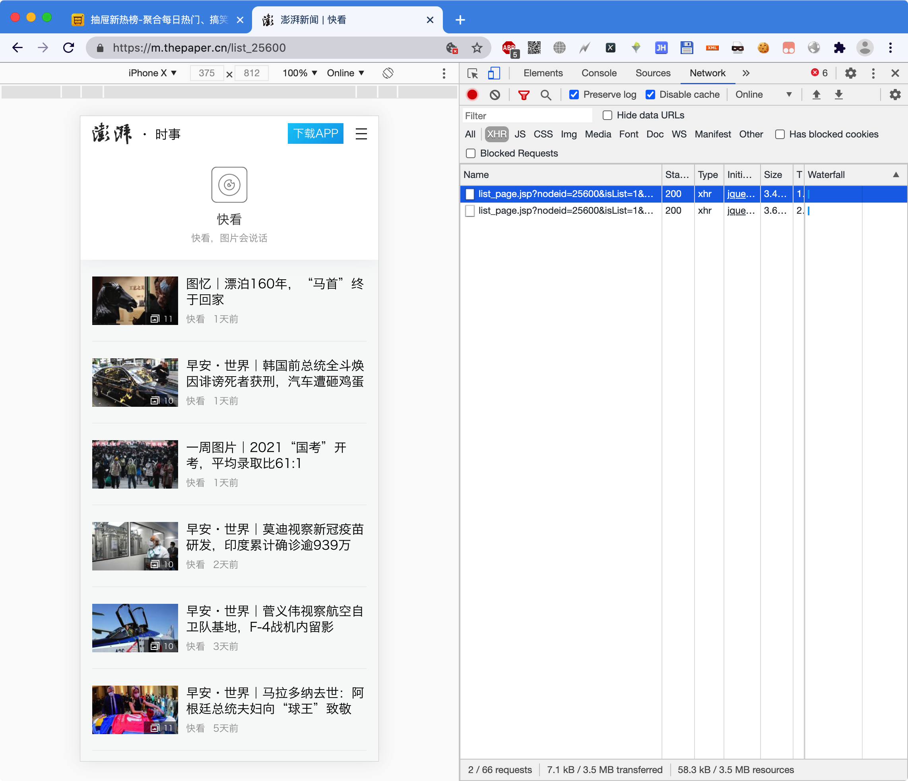
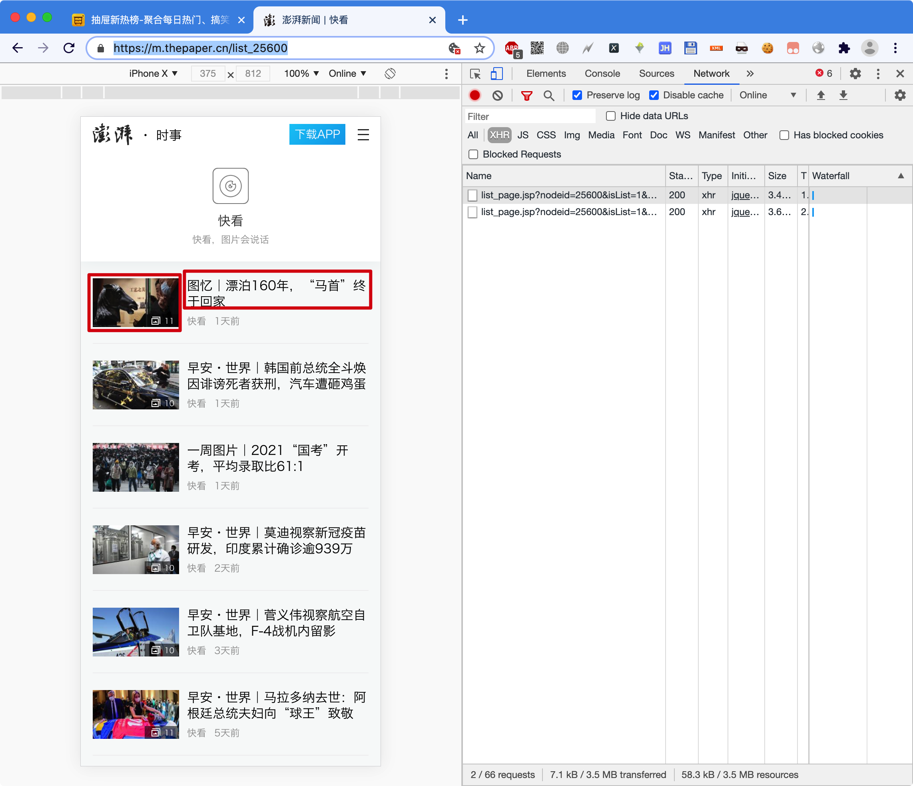

# 澎湃网-时事

## 一、说明

1. URL：https://m.thepaper.cn/list_25600
2. 手机版访问
3. 效果如下：

## 二、要求

1. 从澎湃网站-时事栏目中，爬取100条信息，每条信息要获取标题、图片以及这篇文章的超链接

2. 技术要求：
   1. 使用Redis去重，爬取过的就不再爬取
   2. 所有图片存放到images文件夹
   3. 所有信息（标题、文章超链接）存放到CSV文件（名字任意），CSV要求有表头

